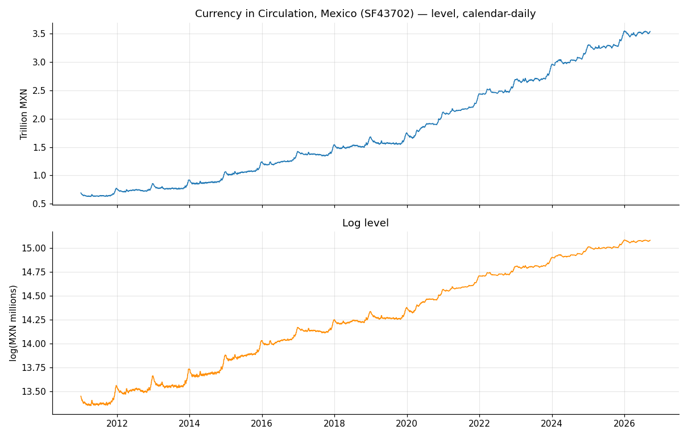
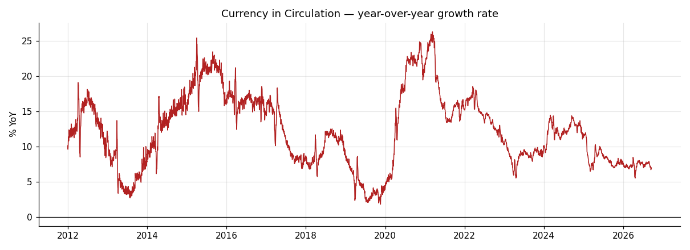
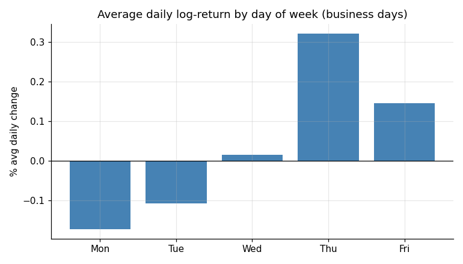
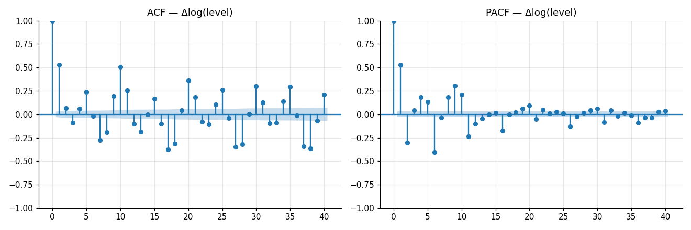
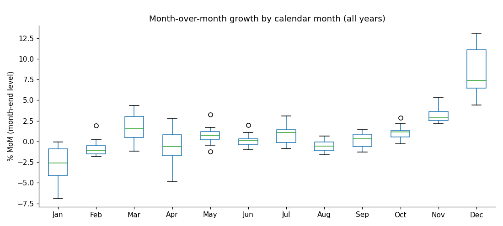
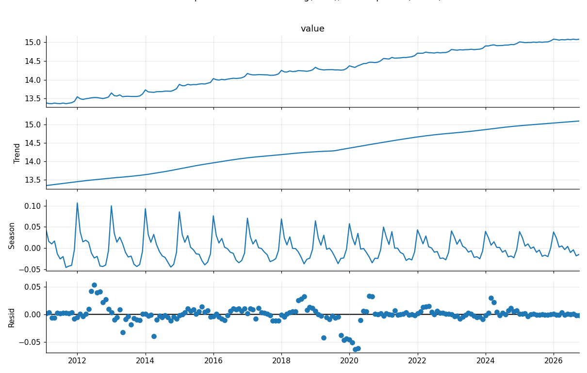
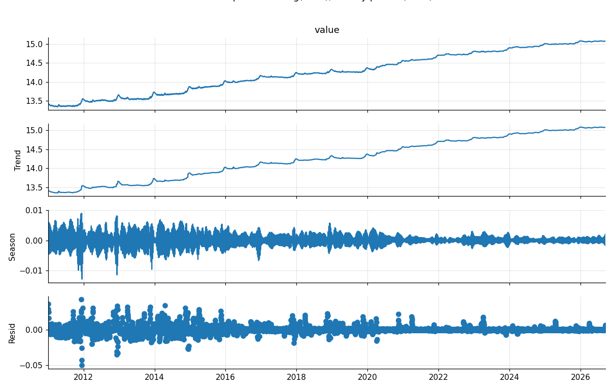
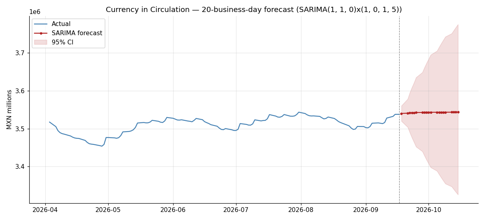

# Mexico Currency in Circulation — Analysis & Forecast

Daily time-series analysis and 20-business-day forecast of **Currency in
Circulation** in Mexico (Banco de Mexico / Banxico), January 2011 to
present.

## Data source

- **Provider:** Banco de Mexico (Banxico), Sistema de Informacion
  Economica (SIE).
- **Series:** `SF43702` — "Billetes y Monedas en Circulacion" (Currency in
  Circulation), from cuadro `CF120`, "Base monetaria, circulante y
  depositos."
- **Coverage:** 2011-01-01 to 2026-09-17 (5,739 calendar days).
- **Units:** MXN millions, end-of-day balance.
- **File:** `data/raw/CIC.xlsx` (Banxico SIE export).

**A note on frequency.** Banxico revalues this balance only on business
days and the raw export carries that value forward flat over weekends —
so the "daily" series is calendar-complete but weekend rows are
non-informative duplicates. We keep the full calendar series for the
history plot, but model on a **business-day ('B')** version
(`data/processed/cic_business_daily.csv`, 4,099 observations), since the
flat weekend points would distort autocorrelation and seasonality
estimates without adding information. Two other Banxico tables were
initially considered and ruled out: `CF104` publishes this balance
*weekly* (every Friday only, despite an internal "Diaria" frequency tag),
and `CF315` is genuinely *monthly* — `SF43702`/`CF120` is the correct
source for a true daily series.

## Project structure

```
Mexico_CB_Notes/
├── data/
│   ├── raw/CIC.xlsx                     # original Banxico export
│   └── processed/                       # cleaned series + forecast output
├── figures/                             # all generated plots + CV/test tables
├── src/
│   ├── data_pipeline.py                 # load, clean, validate
│   ├── eda.py                           # part (a): trend/seasonality plots
│   ├── modeling.py                      # part (b): model selection via CV
│   └── forecast.py                      # part (c): final forecast
├── run_all.py                           # runs the full pipeline end-to-end
└── requirements.txt
```

## How to run

```bash
pip install -r requirements.txt
python run_all.py
```

Each `src/` module can also be run standalone (`python src/eda.py`, etc.)
provided the previous step's output already exists under `data/processed/`.

---

## (a) Data treatment, trend, and seasonality

### Data treatment

1. Parsed the SIE export's fixed metadata header, extracted `{date, value}`.
2. Verified the calendar series is complete (no gaps, no nulls, monotonic
   dates) — see `data_pipeline.validate()`.
3. Converted to business-day frequency by dropping weekend rows (pure
   carry-forward duplicates); public holidays that fall on a weekday are
   left as-is (a genuine "no new balance published" business day, not a
   data gap).
4. Worked in **log levels**: level and log-level both fail an ADF test for
   stationarity and strongly reject KPSS's stationarity null (unit root
   present); the first difference of the log level passes both tests
   cleanly. This also stabilizes variance, since the series' absolute
   volatility grows with its level (see the weekly STL plot).

| series          | ADF stat | ADF p-value | KPSS stat | KPSS p-value |
|-----------------|---------:|------------:|----------:|-------------:|
| level           |   1.42   |    0.997    |    9.77   |     0.010    |
| log(level)      |  -0.63   |    0.864    |   10.06   |     0.010    |
| Δlog(level)     | -10.82   |    0.000    |    0.04   |     0.100    |

→ **d = 1 on the log scale** is the right transform for modeling.

### Trend



Currency in circulation grew from ~MXN 0.69tn (Jan 2011) to ~MXN 3.54tn
(Sep 2026), roughly a 5x increase. The log-level plot shows this is close
to a smooth exponential trend (a straight line in log space) with two
visible regime shifts: an acceleration starting in 2020 (COVID-19
precautionary cash demand — a well-documented global phenomenon) that
never fully reverted, and a further step-up in 2024. Year-over-year growth
(below) makes this explicit: YoY growth ranged 3%–12% through most of the
2010s, spiked above 20% in 2015 and again in 2020–2021, and has settled
back to ~7% recently.



### Seasonality

Two distinct, well-behaved seasonal patterns are present:

**Weekly (day-of-week).** Cash tends to leave circulation early in the
week (Mon/Tue, as weekend spending cash is redeposited) and build up again
before the weekend (Thu/Fri, as households withdraw cash). The ACF/PACF of
the differenced log series show large, significant spikes exactly at lags
5 and 10 — a clean signature of weekly seasonality at business-day
frequency.




**Annual (December holiday demand).** Month-over-month growth is sharply
seasonal: a large, consistent **December spike** (median +7.4% MoM, every
single year in the sample) as households withdraw cash for end-of-year
bonuses ("aguinaldo") and holiday spending, followed by a **January/April
unwind** as that cash flows back into the banking system.



The STL decomposition of month-end levels (period = 12) confirms this is a
stable, repeating annual pattern rather than a one-off event, on top of
the same upward trend seen above:



The weekly STL decomposition (period = 5, on the business-day series)
shows the same trend with the weekly seasonal swing growing in absolute
size as the level grows — the reason we model in log space:



**Other observations:** residuals in both decompositions spike in
2020 (COVID onset) and around other periods of financial stress — the
series is not perfectly smooth even after removing trend and seasonality,
which cross-validation results below also reflect (wider errors in some
folds than others).

---

## (b) Model selection

**Candidates:** SARIMA(p,d,q)(P,D,Q,5) vs. ETS(A,A,A) (additive
error/trend/seasonal Holt-Winters), both with a **weekly seasonal period
(m = 5 business days)** — the seasonality confirmed directly in the
ACF/PACF above — fit on **log(level)**. Fitting ETS(A,A,A) on the log
series rather than the raw level is deliberate: additive trend and
seasonal *in log space* correspond to *multiplicative* trend/seasonal on
the original scale, which matches the variance-grows-with-level behavior
observed in the EDA (a plain ETS(A,A,A) on raw levels would assume
constant-size seasonal swings, which the data clearly reject).

Annual (December) seasonality is visible but was **not** encoded as a
seasonal term directly — a period-252 seasonal ARIMA/ETS component is
both numerically impractical to estimate reliably and unnecessary for a
20-business-day-ahead forecast that, in this run, doesn't span December;
it is discussed as a limitation below.

**Order selection.** SARIMA orders were chosen via an AIC grid search
(p, q ∈ {0,1,2}, P, Q ∈ {0,1}, d = 1 fixed, D ∈ {0,1}, m = 5) on the most
recent 750 business days, then fixed for evaluation. Selected order:
**SARIMA(1,1,0)(1,0,1,5)**.

**Validation method.** Rolling-origin (expanding-window) cross-validation:
12 folds, each training on all data up to a cutoff and forecasting the
next 20 business days out-of-sample, with cutoffs stepped forward 20 days
at a time so the 12 folds together cover the most recent ~11 months
(2025-10 to 2026-08) — including the December 2025 holiday spike, a
genuine stress-test of each model's seasonal handling. Errors are computed
in **level space** (MXN millions) by exponentiating the log forecasts,
since that's the operationally meaningful unit.

| model        |    RMSE |     MAE |  MAPE |
|--------------|--------:|--------:|------:|
| ETS(A,A,A)   | 59,642  | 50,182  | 1.44% |
| **SARIMA**   | **26,047** | **21,747** | **0.63%** |

SARIMA dominates on every metric, roughly **halving RMSE/MAE and cutting
MAPE by more than half**. The gap is largest exactly where it matters
most: in the fold spanning the December 2025 holiday spike, ETS's MAPE
blew out to 3.68% (and to 2.59%/4.20%/1.17% in three other folds) while
SARIMA stayed in a tight 0.27%–1.43% band across all 12 folds. ETS(A,A,A)'s
fixed additive weekly seasonal component and simple linear trend
extrapolation have no mechanism to react to the sharp trend
acceleration/deceleration around the holidays; SARIMA's autoregressive and
seasonal-AR/MA terms adapt to recent momentum far better.

**Selected model: SARIMA(1,1,0)(1,0,1,5)** on log(level), refit on the
full history for the final forecast.

Full per-fold results: `figures/cv_results.csv`; averages:
`figures/cv_summary.csv`.

---

## (c) 20-business-day forecast

The selected model was refit on the **entire** available history
(2011-01-03 to 2026-09-17, n = 4,099 business days) and used to forecast
the next 20 business days (2026-09-18 to 2026-10-15).



| date       |   forecast | 95% lower | 95% upper |
|------------|-----------:|----------:|----------:|
| 2026-09-18 | 3,540,317  | 3,520,055 | 3,560,696 |
| 2026-09-25 | 3,542,763  | 3,452,348 | 3,635,545 |
| 2026-10-02 | 3,543,416  | 3,397,782 | 3,695,293 |
| 2026-10-09 | 3,543,591  | 3,354,734 | 3,743,080 |
| 2026-10-15 | 3,543,625  | 3,325,893 | 3,775,611 |

(Full 20-day table: `data/processed/forecast_next_20bd.csv`.)

**Findings.** The forecast is essentially **flat**: from the last actual
value of MXN 3,537,968mn (2026-09-17) to MXN 3,543,625mn at the 20-day
horizon — a **+0.16%** total move. This is consistent with the seasonal
story from part (a): late September through mid-October falls in the
year's *quietest* seasonal window (well past the Sep month-end bump, well
before the December surge), so the model correctly reverts to trend-only
growth with only a small weekly wiggle superimposed, rather than
projecting a large directional move. The 95% confidence interval widens
from ±0.6% at day 1 to about **-6.1%/+6.5%** at day 20, reflecting genuine
compounding uncertainty at that horizon — reasonable given the historical
20-day-ahead RMSE from cross-validation (~26,000, i.e. ~0.7% of the
current level) is well inside this band.

**Limitations / next steps:**
- The model has no explicit annual-seasonal term, so a forecast that
  *does* span December (or another month with a strong, well-documented
  MoM effect — see the boxplot in part (a)) would need either a seasonal
  regressor for known calendar effects (month-end, pre-holiday, "quincena"
  paydays) or a longer seasonal period, at real estimation cost.
- Mexican bank holidays that fall on a weekday are treated as ordinary
  business days; a small accuracy gain is likely available from an
  explicit holiday calendar/dummy.
- The 20-day walk-forward CV window, while it does include the December
  2025 spike, is still a modest sample (12 folds) for comparing two models
  robustly; a longer backtest (e.g., stepping through multiple years)
  would sharpen the model-selection evidence further.
